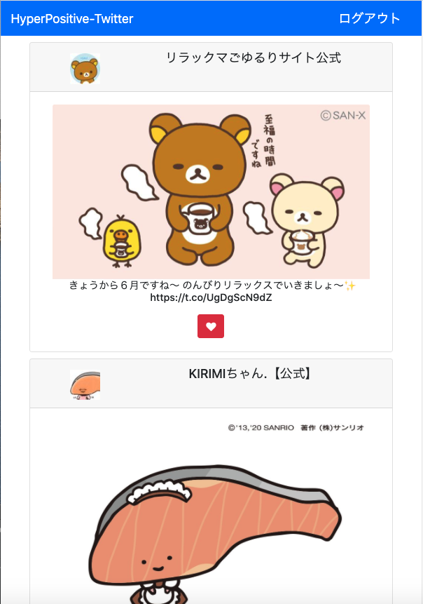

# 概要
Auth認証を利用したTwitterクライアントのデモアプリです。 
GCPのNatural Language APIを使い、ネガティブなツイートを非表示にします。

### 環境
- Spring Boot 2.3.0
- Gradle 6.0.1
- twitter4j 4.0.7
- Google Natural Language Api 1.100.0

## 画面

## 感想
- フロント部分をReactなどで作り直したい。thymeleafだけで要素を動的に表示するのが難しそう
- 現状バックエンドにKotlin+Spring Bootを使う意味がほぼないので、GCPでなくjavaの機械学習ライブラリを使うなどの工夫がしたい。
  JavaにはDeepLearning4Jがある
- 認証キー等を直接レポジトリに入れてるので現状ではデプロイできない、本番環境で使うためにはどうすればいいか調べる必要がある
- 正直OAuth認証について未だによくわかってないので根本的に勉強が必要

## 参考サイト

https://careydevelopment.us/2017/05/24/implement-twitter-login-solution-spring-boot/  
https://cloud.google.com/natural-language/docs/analyzing-sentiment?hl=jahttps://cloud.google.com/natural-language/docs/analyzing-sentiment?hl=ja
